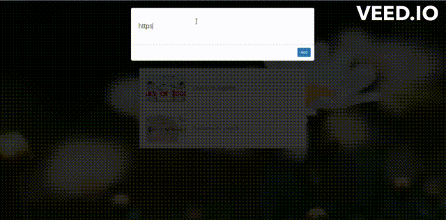

# Bookmarking App

This project was completed as a part of Chris Sev's [Getting Started with JavaScript](https://chrissev.gumroad.com/l/getting-started-with-javascript/) course in conjunction with the [Codefi CodeLabs](https://www.codelabsdash.com/) bootcamp curriculum.

## Table of Contents

- [Bookmarking App](#bookmarking-app)
  - [Table of Contents](#table-of-contents)
  - [The Project](#the-project)
    - [HTML](#html)
    - [CSS](#css)
    - [JavaScript](#javascript)
      - [`localStorage`](#localstorage)
      - [OpenGraph](#opengraph)
  - [Reflection](#reflection)
  - [Acknowledgements](#acknowledgements)

## The Project

The Bookmarking App features a pop up input box that lets the user enter a full website address and add it to a collection of clickable links.  Once added, clicking the link will take the user to the website.  If no longer needed, the links can be deleted individually.  Each bookmark is stored locally, so refreshing the page will not clear the list.

### HTML

The HTML for this project is fairly simple.  There's a *floater* where the user types the bookmark link and the *bookmark list* with submitted links.  In order to create the effect where the bookmark list and background go dark when the floater input is selected, an *overlay* div is included as well.

### CSS

Continuing with the overlay, its `z-index` is set under the floater and above the bookmark list and background.  That way, when the floater is selected, the overlay's `opacity` changes to darken everything behind it.  The floater scales up in size and stands out on the page because it is the only part of the app that doesn't darken behind the overlay.  The overlay's `pointer-events` is set to `none` when the floater is not selected so that it doesn't trigger any events.  It's reset to `all` when the floater is selected so the user can click out of the floater.  The body class `show-floater` was used as a conditional to coordinate these events.

Another helpful feature was setting up a *default avatar* for each bookmark image.  If a website doesn't have an image, then the default avatar will appear.

For this CSS, I used a new selector, `input[type=text]`.  This syntax allows the developer to select a specific input type rather than just `inupt` alone.

At the end of the project, I added additional hover effects to improve the UX when removing bookmarks.  First, I made the padding around the 'X' a little bigger to offer more wriggle room when clicking on the 'X'.  Second, though the 'X' appears and turn gray when hovering hover a given bookmark, I made it even darker when hovering directly over the 'X' itself.  Both of these effects should help the user more easily remove bookmarks.

### JavaScript

For me, the JavaScript portion of this project was the meat.  It's where I learned the most.  Helpful tidbits include:

- Set a default function parameter with `=`
- Pass in `i` as a second parameter in `map()` as a handy way to add `data-ID` attributes and ID specific elements (e.g. bookmarks)
- `console.dir(element)` to see everything you have access to
- Check if a mouse click was on a given element when the event listener is attached to the parent element with `e.target.matches('element')`
- Set options like the following in case nothing is in `localStorage` yet:
  - `const bookmarks = JSON.parse(localStorage.getItem('books')) || [];`

#### `localStorage`

`localStorage` is a web API in JavaScript that stores key value pairs in a web browser with no expiration time.  It's often used for caching data, storing user preferences, and in general storing data when the user navigates away from the page or closes the browser.  Its methods include:
    - Storing and updating data: `.setItem()`
    - Retrieving data: `.getItem()`
    - Removing data: `.removeItem()`
    - Clearing all data: `.clear()`

In this project, I used `.getItem()` and `.setItem()` to keep the bookmark list up to date even when refreshing the page or leaving the app and coming back later.

#### OpenGraph

[OpenGraph](https://www.opengraph.io/) is a simple web scraper API.  For this project, I used OpenGraph to get a title, image, and url for each bookmark.  The image displays on the left and the title on the right with a working url when the user clicks on the bookmark.

In order to use OpenGraph, I set up an account and got an authentication token to access their API.

## Reflection

Overall, this was a neat project.  I'm really glad I got experience working with `localStorage` and OpenGraph in particular.  All the little tidbits throughout the HTML, CSS, and JavaScript were helpful as well.  No matter how many times I go back to basics, I always learn something new.

In future projects, I'd like to dive into the backend more and work with APIs.  I also am curious about `sessionStorage` and the differences I will find there.  Another topic I'm interested in is best practices for security-minded development.  My cybersecurity friends would be proud.

## Acknowledgements

Shoutout to [Dominika Roseclay](https://www.pexels.com/photo/shallow-focus-photograph-of-daisy-flower-1166869/) for taking the flower photo used as a background in this project.

Shoutout to [Chris Sev](https://chrissev.gumroad.com/) for his course [Getting Started with JavaScript](https://chrissev.gumroad.com/l/getting-started-with-javascript/).  He does a good job simplifying JavaScript concepts and then applying them to projects like these.

Another shoutout to [Codefi CodeLabs](https://www.codelabsdash.com/) for putting together this course and pulling in the best resources for learning software development.  The code coaches and this semester's cohort have been awesome to work with.
